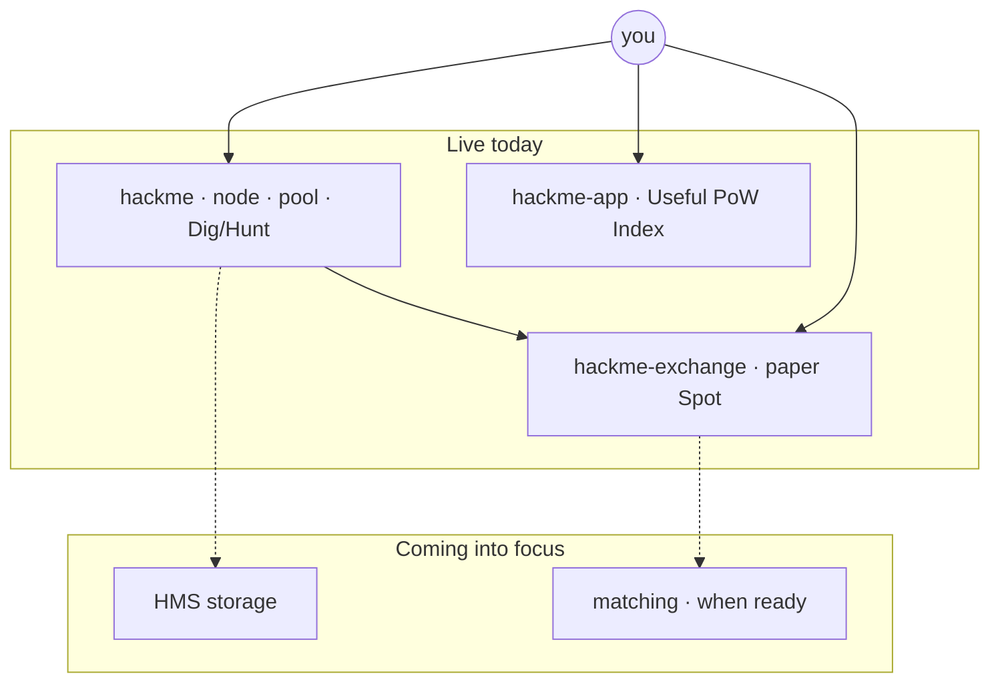

<!--
  GitHub profile README — https://github.com/jokeez
-->

<pre aria-label="HackMe Network">
██╗  ██╗ █████╗  █████╗ ██╗  ██╗███╗   ███╗███████╗
██║  ██║██╔══██╗██╔════╝██║ ██╔╝████╗ ████║██╔════╝
███████║███████║██║     █████╔╝ ██╔████╔██║█████╗  
██╔══██║██╔══██║██║     ██╔═██╗ ██║╚██╔╝██║██╔══╝  
██║  ██║██║  ██║╚██████╗██║  ██╗██║ ╚═╝ ██║███████╗
╚═╝  ╚═╝╚═╝  ╚═╝ ╚═════╝╚═╝  ╚═╝╚═╝     ╚═╝╚══════╝
</pre>

# Building the [HackMe](https://hackme.tech) ecosystem

Open network where **hashrate does useful work** — mine, trade on paper, discover useful-PoW projects, and ship security campaigns. Hub: **[hackme.tech](https://hackme.tech)**

 

 

 

**[▶ Watch the walkthrough](https://www.youtube.com/watch?v=KdRr6zK2QVE)** — what the network is and how to get started

---

## Ecosystem map

| Piece | What it is | Status | Code |
|-------|------------|--------|------|
| **Core node + pool** | Useful PoW · GPU/CPU miners · Dig/Hunt · research ledgers · installers | **Live** (rc17) | [jokeez/hackme](https://github.com/jokeez/hackme) |
| **HackMe Spot** | Paper terminal for **HMC / SUP** — no custody, no public matching | **Live** (paper) | [jokeez/hackme-exchange](https://github.com/jokeez/hackme-exchange) |
| **Useful PoW Index** | Curated registry of projects where hashrate does real work | **Live** | [jokeez/hackme-app](https://github.com/jokeez/hackme-app) |
| **HMS** | Encrypted storage / seal lane | **Preview** | in [hackme](https://github.com/jokeez/hackme) · [roadmap](https://hackme.tech/) |
| **Matching API** | Private loopback ledger for Spot (lab) | **Private / lab** | — |

---

## Repositories

<table>
<tr>
<td width="33%" valign="top">

### [hackme](https://github.com/jokeez/hackme)
**Network core**

Public HTTP pool, Windows/Linux/deb/ISO, Dig & Hunt rails, research reports.

[Downloads →](https://hackme.tech/downloads.html)

</td>
<td width="33%" valign="top">

### [hackme-exchange](https://github.com/jokeez/hackme-exchange)
**Paper Spot**

Open-source terminal for HMC/SUP practice. Desk: [exchange.hackme.tech](https://exchange.hackme.tech)

</td>
<td width="33%" valign="top">

### [hackme-app](https://github.com/jokeez/hackme-app)
**Useful PoW Index**

Discover & list projects where mining does real work — free curated registry.

</td>
</tr>
</table>

Product detail (packages, escrow, pool economics) lives in **[hackme README](https://github.com/jokeez/hackme)** — this profile is the map of the ecosystem, not a second copy of the core docs.

---

## Now → next

| Now | Next |
|-----|------|
| Mine on the public pool · verify SHA256 · ship Dig/Hunt orders | Deeper **HMS** storage lane |
| Paper Spot for HMC/SUP | Matching only after security bar (no public edge yet) |
| Grow the Useful PoW Index | More listed useful-work projects |
| Research ledgers (Hunt Watch, OSS CVE, …) | Keep publishing evidence, not hype |

---

## Quick links

[hackme.tech](https://hackme.tech) ·
[Downloads](https://hackme.tech/downloads.html) ·
[Exchange](https://exchange.hackme.tech) ·
[Developers](https://hackme.tech/developers.html) ·
[Research](https://hackme.tech/research.html) ·
[Telegram](https://t.me/hackme_tech) ·
[YouTube](https://www.youtube.com/watch?v=KdRr6zK2QVE) ·
[Bitcointalk ANN](https://bitcointalk.org/index.php?topic=5583373.0)

 

Not financial advice · Official hub: <b>hackme.tech</b> only · verify checksums before install

